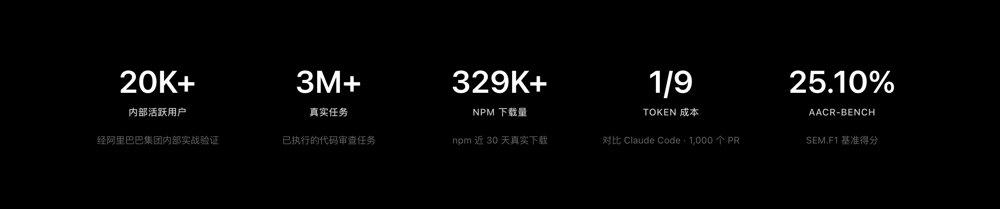
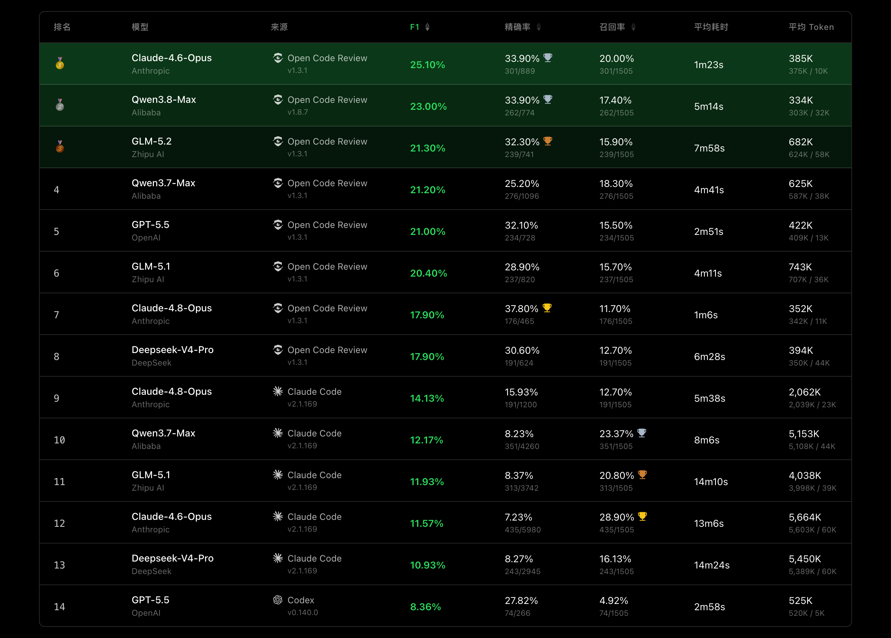
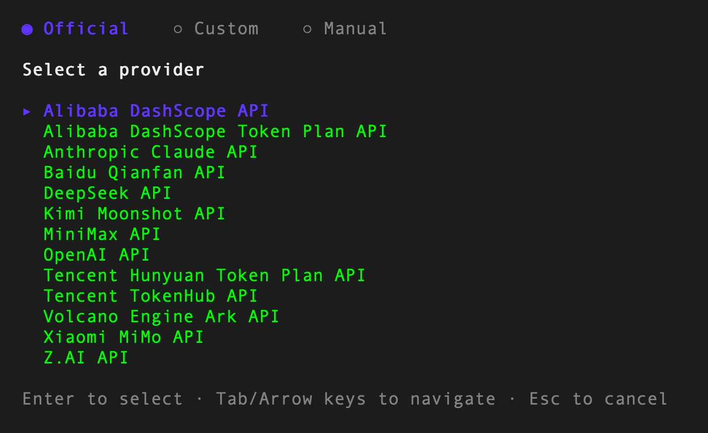

<div align="center">
  <a href="https://open-codereview.ai">
    
  </a>
  <h1>OpenCodeReview</h1>
  <p><b>阿里巴巴开源 AI 代码审查工具 — 确定性工程 × Agent 混合驱动的下一代代码审查平台</b></p>
</div>

<p align="center">
  <a href="https://trendshift.io/repositories/41087?utm_source=repository-badge&amp;utm_medium=badge&amp;utm_campaign=badge-repository-41087" target="_blank" rel="noopener noreferrer">
    
  </a>
</p>
<p align="center">
  <a href="https://trendshift.io/repositories/41087" target="_blank">
    
  </a>
  <a href="https://trendshift.io/repositories/41087" target="_blank">
    
  </a>
</p>
<p align="center">
  <a href="https://www.npmjs.com/package/@alibaba-group/open-code-review"></a>
  <a href="https://github.com/alibaba/open-code-review/actions/workflows/release.yml"></a>
  <a href="LICENSE"></a>
  <a href="https://deepwiki.com/alibaba/open-code-review"></a>
  <a href="https://www.bestpractices.dev/projects/13328"></a>
</p>
<p align="center">
  <a href="#supported-platforms"></a>
  <a href="#supported-platforms"></a>
  <a href="#supported-platforms"></a>
  <a href="#supported-agents"></a>
  <a href="#supported-agents"></a>
  <a href="#supported-agents"></a>
  <a href="#supported-agents"></a>
  <a href="#supported-agents"></a>
</p>
<p align="center">
  简体中文 | <a href="README_EN.md">English</a> | <a href="docs/i18n/README.ja-JP.md">日本語</a> | <a href="docs/i18n/README.ko-KR.md">한국어</a> | <a href="docs/i18n/README.ru-RU.md">Русский</a>
</p>

---

## Open Code Review 是什么？

**Open Code Review**（简称 `ocr`）是一款由阿里巴巴开源的 AI 驱动自动化代码审查 CLI 工具。它的前身是阿里集团内部官方 AI 代码审查助手，在内部经过两年打磨，服务了数万开发者，识别了数百万个实际代码缺陷。在超大规模研发场景充分验证后，正式作为开源项目回馈社区。

它读取 Git diff，通过具备工具调用能力的 Agent 将变更文件发送至可配置的 LLM，生成具有**行级精度**的结构化审查意见。Agent 可以读取完整文件内容、搜索代码库、检查其他变更文件以获取上下文，从而进行深度审查——而非仅停留在表面的 diff 反馈。除了 diff 审查，`ocr scan` 还可以审查全量代码文件，适用于审计不熟悉的代码库或缺少 git diff 的全新目录。

官方站点：[open-codereview.ai](https://open-codereview.ai)



---

## 基准测试 (Benchmark)

> 相比通用 Agent（Claude Code），Open Code Review 在相同底层模型下取得了显著更高的 **准确率（Precision）** 与 **F1 综合得分**，同时仅消耗 **约 1/9 的 token**、审查更快。但召回率（Recall）低于通用 Agent——这是以精准度换取低噪声的设计取舍。

基于真实场景的代码审查基准测试，从 **50** 个热门开源仓库中精选 **200** 个真实的 Pull Request，覆盖 **10** 种主流编程语言——由 80+ 位资深工程师交叉标注验证（共 **1,505** 个标注缺陷）。

<a href="https://huggingface.co/datasets/Alibaba-Aone/aacr-bench"> 在 Hugging Face 上探索 AACR-Bench 数据集</a>。

| 指标 | 含义 | 为什么重要 |
|------|------|-----------|
| **F1** | 准确率与召回率的调和均值 | 综合衡量审查质量的最佳单一指标 |
| **准确率 (Precision)** | 报告的问题中真正有效的比例 | 越高 = 误报越少，大幅降低排查成本 |
| **召回率 (Recall)** | 真实缺陷中被发现的比例 | 越高 = 漏报越少，更多问题不会遗漏 |
| **平均耗时 (Avg Time)** | 每次审查的实际耗时 | 决定 CI 流水线的等待延迟 |
| **平均 Token (Avg Token)** | 每次审查消耗的总 token 数 | 直接影响 API 调用成本 |



---

## 为什么选择 Open Code Review？

### 通用 Agent 的局限
如果你深度用过 Claude Code 等通用 Agent + 纯 Prompt Skills 方案做代码审查，可能对以下问题深有同感：
- **覆盖不全** —— 变更较大时，Agent 倾向于“偷懒”，选择性地审查部分文件，导致致命缺陷漏报。
- **位置漂移** —— 报告的问题与实际代码位置常常对不上，出现行号或文件偏移。
- **效果不稳定** —— 基于纯自然语言驱动的 Skills 难以调试，审查质量因提示词的细微差异而大幅波动。

这些问题的根源在于：**纯语言驱动的架构缺乏对审查流程的硬约束**。

### 核心设计：确定性工程 × Agent 混合驱动

Open Code Review 的核心哲学是将**确定性工程**与 **LLM Agent** 紧密结合，各司其职。

#### 1. 确定性工程——负责强约束
对代码审查场景中“不能出错”的环节，由工程逻辑而非语言模型来保证：
- **精准的文件筛选** —— 明确哪些文件需要审查、哪些应当过滤，确保真正重要的改动一个不漏。
- **智能的文件打包** —— 将关联文件归并为同一审查单元（例如国际化文件、类型与实现）。每个包作为 sub-agent 进行任务，上下文完全隔离——这一分治策略在超大变更场景下表现极为稳定，同时天然支持高并发。
- **精细化规则匹配** —— 针对不同语言与文件特征，匹配针对性的审查规则，从源头规避信息噪声。
- **外挂的定位与反思组件** —— 独立的评论定位模块与评论反思模块，系统性提升 AI 反馈的位置准确性与内容准确性。

#### 2. Agent——负责动态决策与理解
将 Agent 的优势集中发挥在它真正擅长的地方——动态决策、上下文深度召回：
- **场景化提示词调优** —— 深度优化代码审查专用的提示词模板，提升效果的同时压缩 Token 开销。
- **场景化工具集沉淀** —— 经真实线上数万工程师轨迹分析裁剪出的专属审查工具链，稳定可靠。

---

## 本项目内置技能 (Skills)

在当前 `hch-skills-hub` 项目中，Open Code Review 已深度集成并注册为可直接调用的技能：

| 技能名称 | 路径 | 模式说明 |
|---------|------|---------|
| **[open-code-review](./skills/open-code-review/)** | `skills/open-code-review/SKILL.md` | **完整驱动模式**：直接调用本地安装的 `ocr` CLI，自动完成文件筛选、规则匹配、LLM 推理审查与结构化行级评论输出。 |
| **[open-code-review-delegate](./skills/open-code-review-delegate/)** | `skills/open-code-review-delegate/SKILL.md` | **委托模式 (Delegate)**：无需 OCR 端配置 LLM；OCR 仅负责确定性工程（文件预检筛选与审查规则解析），由当前智能体（如 Antigravity / DSH / Claude）自身利用其大模型能力执行深度审查。 |

---

## 快速安装与使用

### 1. 前置环境
- **Git >= 2.41**：Open Code Review 依赖 Git 进行 diff 生成、代码搜索与版本操作。
- **Node.js / npm**（用于通过 npm 安装 CLI）或直接下载 GitHub Release 二进制。

### 2. 安装 CLI
```bash
# 全局安装
npm install -g @alibaba-group/open-code-review
```

### 3. 配置 LLM（仅默认模式需要；委托模式无需配置）
```bash
ocr config provider          # 选择内置供应商或添加自定义供应商（OpenAI、Anthropic、Bedrock等）
ocr config model             # 为当前供应商选择模型
```


### 4. 常用审查命令

```bash
cd your-project

# 1. 工作区模式：审查工作区所有暂存与未暂存的变更
ocr review

# 2. 携带业务背景（推荐，大幅提升审查准确率）
ocr review --audience agent -b "重构用户认证逻辑，由 Session 迁移至 JWT"

# 3. 分支对比：审查 feature 分支相对于 main 分支的变更
ocr review --from main --to feature-branch

# 4. 单个 Commit 审查
ocr review --commit abc123

# 5. 全量文件扫描（无需 git diff）
ocr scan --path src/service

# 6. 输出结果到 JSON 文件（供智能体或 CI 解析）
ocr review --format json --output review-result.json

# 7. 委托模式（Delegate Mode：由当前 AI Agent 自身进行审查）
ocr delegate preview --format json
ocr delegate rule --format json src/user.go src/auth.go
```

---

## 跨智能体与平台适配 (Agent Integrations)

Open Code Review 支持主流 AI 编码助手集成：
- **Google Antigravity**：已在 `.agents/skills.json` 注册，支持在会话中通过 `/open-code-review` 或 `/open-code-review-delegate` 触发。
- **DeepSeek Harness (DSH)**：将技能目录挂载至 DSH 技能池，智能体可按需执行审查或委托审查。
- **Claude Code**：支持专用斜杠命令插件（参见 `plugins/open-code-review/claude-code/`）。
- **Cursor**：内置 `.cursor-plugin` 规范（参见 `plugins/open-code-review/`）。
- **Kimi Code & Codex**：内置支持插件。
- **CI/CD 流水线**：内置 GitHub Actions（`action.yml`）、GitLab CI、Gerrit 等流水线脚本。

---

## 目录结构

```
open-code-review/
├── cmd/opencodereview/         # Go CLI 命令行实现
├── internal/                   # 核心确定性引擎、规则匹配、Agent 运行时与工具集
├── skills/                     # 智能体可直接加载的 Skill 定义
│   ├── open-code-review/       # CLI 直接审查技能 (SKILL.md)
│   └── open-code-review-delegate/ # 委托模式技能 (SKILL.md)
├── plugins/                    # 针对 Claude Code、Cursor、Kimi、Codex 等插件配置
├── docs/                       # 官方多语言文档与深度技术指南
├── imgs/                       # 架构图、基准对比图与示意图
├── action.yml                  # GitHub Action CI 集成定义
├── install.sh / install.ps1    # 跨平台一键安装脚本
├── README.md                   # 本中文说明文档
└── README_EN.md                # 原始英文说明文档
```

---

## 文档索引

- [官方文档中心](https://open-codereview.ai/docs)
- [快速开始](https://open-codereview.ai/docs/quickstart)
- [CLI 完整命令参考](https://open-codereview.ai/docs/cli-reference)
- [审查规则配置手册](https://open-codereview.ai/docs/review-rules)
- [CI/CD 自动化集成](https://open-codereview.ai/docs/cicd)
- [中文贡献指南](docs/i18n/CONTRIBUTING.zh-CN.md)

---

## 许可证

本项目遵循 [Apache-2.0](LICENSE) 开源许可证。
Copyright 2026 Alibaba Group.
